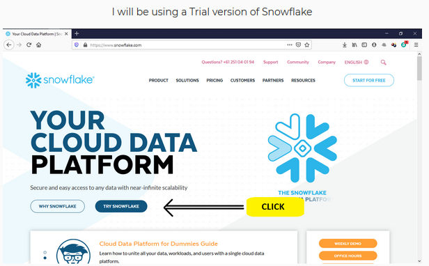
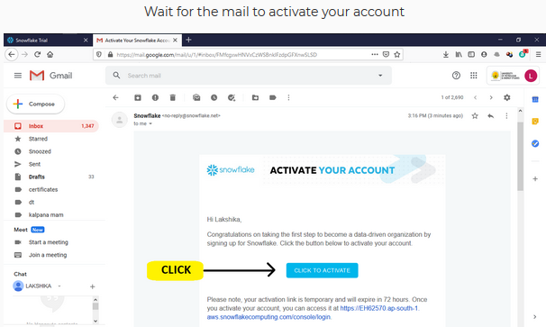

# Connection-Setup-between-zepl-and-snowflake

## Create an account in Snowflake

There are three types of Snowflake edition

**Standard Edition**: This is best for personal use. It provides us unlimited access to all Snowflake features.

**Enterprise Edition**: Best for large-scale Organizations and Enterprises. It provides us all the features of Standard Edition with some additional features designed particularly for Enterprises.

**Business Critical Edition**: It provides us all the features of enterprise Edition with enhanced security and data protection.

So, I will choose Standard Edition as I need snowflakes for personal use and AWS as my cloud provider.

There are many data science analytics platforms in the market that connect with snowflake but in my experience, I prefer using Zepl as it has many features compared to other platforms I tried. We can establish a **connection between snowflake and zepl in just one click**.

#### Go to Partner Connect and just click on zepl

Snowflake will automatically give you credentials and connect you with zepl. Remember Only account admin can create connections with snowflake partners.

So I am working on a zepl notebook for running my python script.

You just have to add the resource then we are ready to go. In your code, you have to add a single line which zepl provides you just click in the symbol (</>) and you will get the statement you need to add in whichever language you are working on as I am going to write a python script so I will copy for the python.

` conn=z.getDatasource(“snowflake_HG36605apsouth1aws_bf684a”) `

In the next part we will start writing our script to get data from different sources in zepl
