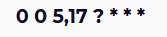

Let’s create our prediction model……

For prediction, we are using the data of the past 12 days so we will fetch that data from snowflake and store it in a list. We need to sort it as the data we fetched is in the descending format so it can affect our prediction.

>> <pre>sql = "SELECT TOTAL_CASES FROM INDIA_DATA ORDER BY DATE DESC LIMIT 12" 
>>res =execute_result(conn,sql) 
>>confirmed = [item for t in res for item in t] 
>>confirmed.sort()</pre>

Now we are fetching the information from snowflake which are required in predictions like latest_recovered, latest_date, latest_deaths, population. Remember when we fetch the data from snowflake it returns it as a list of tuples.

>> <pre> sql = "SELECT RECOVER FROM RECOVERED_DATA ORDER BY DATE DESC LIMIT 1" 
>>res = execute_result(conn, sql) 
>>recovered = [item for t in res for item in t]
>>sql = "SELECT DATE FROM RECOVERED_DATA ORDER BY DATE DESC LIMIT 1" 
>>res = execute_result(conn, sql) 
>>start_date = [item for t in res for item in t] 
>>start_date = start_date[0] 
>>sql = "SELECT TOTAL_DEATHS FROM INDIA_DATA ORDER BY DATE DESC LIMIT 1" 
>>res = execute_result(conn, sql) 
>>deaths = [item for t in res for item in t]
>>sql = "select DISTINCT(POPULATION) from INDIA_DATA" 
>>res = execute_result(conn,sql) 
>>population = [item for t in res for item in t] 
>>population = population[0]</pre>

### SIR(Susceptible, Infected, Recovered) model

The SIR model was first used by Kermack and McKendrick in 1927 and has subsequently been applied to a variety of diseases, especially airborne childhood diseases with lifelong immunity upon recovery, such as measles, mumps, rubella, and pertussis. S, I and R represent the number of susceptible, infected, and recovered individuals, and 

N = S + I + R

is the total population.

The infectious rate, 𝞫, controls the rate of spread which represents the probability of transmitting disease between a susceptible and an infectious individual. Recovery rate, 𝜸= 1/D, is determined by the average duration, D, of infection. For the SIRS model, ξ is the rate that recovered individuals return to the susceptible statue due to loss of immunity.

We will learn about the model in two parts first we will estimate the contact rate and then fit the model. 

First we are finding the contact rate using our past data and recovery rate . To know more about contact rate in covid19 refer this doc (https://arxiv.org/abs/2004.07750)

>> <pre>#model creation    
>>sigma = 4.4    
>>beta_sum = 0    
>>recovery_rate = 1/14    
>>for i in range(10):        
>>       cases_day_1 = confirmed[i]        
>>       cases_day_2 = confirmed[i + 1]        
>>       cases_day_3 = confirmed[i + 2]        
>>       infected_ratio_day_1 = cases_day_1 / population        
>>       infected_ratio_day_2 = cases_day_2 / population        
>>       infected_ratio_day_3 = cases_day_3 / population        
>>       ej1 = (infected_ratio_day_2 - infected_ratio_day_1 + (recovery_rate * infected_ratio_day_1)) / sigma        
>>       ej2 = (infected_ratio_day_3 - infected_ratio_day_2 + (recovery_rate * infected_ratio_day_2)) / sigma        
>>       r1 = recovery_rate * infected_ratio_day_1        
>>       s1 = 1 - (infected_ratio_day_1 + ej1 + r1)        
>>       beta = (ej2 - ej1 + (sigma * ej1)) / (s1 * infected_ratio_day_1)        
>>       beta_sum += beta
>>contact_rate=beta_sum/12

Then I have fit the model according to my data and needs. I took help from Outbreak prediction model (https://colab.research.google.com/drive/18fg8TcDpLalAH0LMvAlSGefbbjSX2NbW#scrollTo=ucqTyV4D4h9k). From the model, we can predict the infected and recovered people. (I) gives a list of predicted total cases and R is for recoveries.

>> <pre>Last_infected, Last_recovered = confirmed[-1], recovered[0]  
>> # Initial conditions for infected and recovered people    
>>Last_deaths = deaths[0]
>>everyone_else = population - Last_infected - Last_recovered - Last_deaths     
>>Current_condition = everyone_else, Last_infected, Last_recovered
>>time = np.linspace(0, 8, num=8)    
>>def SIR(Current_condition, t, population, contact_rate, recovery_rate):        
>>              S, I, R = Current_condition        
>>              dS = -contact_rate * S * I / population        
>>              dI = contact_rate * S * I / population - recovery_rate * I        
>>              dR = recovery_rate * I        
>>              return dS, dI, dR

Store the prediction dates in a list and then we will zip dates, total cases and recoveries in a dataframe . After that create a table for the predicted data and push the data in stage and then copy into tables

>> <pre>future_forecast_dates = [] 
>> for i in range(9): 
>>            future_forecast_dates.append((start_date + timedelta(days=i)).strftime("%m/%d/%Y")) 
>>result = odeint(SIR, Current_condition, time, args=(population, contact_rate, recovery_rate)) 
>>S, I, R = result.T prediction = set(zip(future_forecast_dates[-10:], I ,R)) 
>>prediction = pd.DataFrame(prediction)</pre>

For better convenience, we are creating a table name prediction to compare our predicted data with actual data. I am creating a table directly in snowflake because we just need to create it once.So write this command in snowflake worksheet

>    ⇒ CREATE TABLE PREDICTION(date DATE,PREDICTION_INFECTED DOUBLE,INFECTED DOUBLE)

>> <pre>  try: 
>>         sql = 'DROP TABLE TEMP_TABLE' 
>>         conn.execute(sql) 
>>    except: 
>>         pass 
>>    sql = 'CREATE TABLE TEMP_TABLE(date DATE,infected DOUBLE , recovered DOUBLE)' 
>>    conn.execute(sql)
>>    prediction.to_csv("prediction_data.csv", index=False, header=False) 
>>    prediction = pd.read_csv("prediction_data.csv")
>>    csv_file = 'prediction_data.csv' sql = "PUT file://" + csv_file + " @DATA_STAGE auto_compress=true" 
>>    conn.execute(sql)
>>    sql = 'copy into TEMP_TABLE from @DATA_STAGE/prediction_data.csv.gz file_format = (type = "csv" field_delimiter = "," skip_header = 1)' \ 'ON_ERROR = "ABORT_STATEMENT" ' 
>>    conn.execute(sql)
>>except Exception as e: 
>>      print(e) </pre>

We have completed creating our model as well as Script and getting the prediction of next 7 days. So now let’s schedule our script to run at a particular time . My script is running twice daily at 5a.m and 5p.m so the cron expression 

In the next part we will create a Prediction table in snowflake using streams and task to compare our result and for better visualization

Snowflake feature included:

* Access Control
* Partner connect
* Analytic Function

